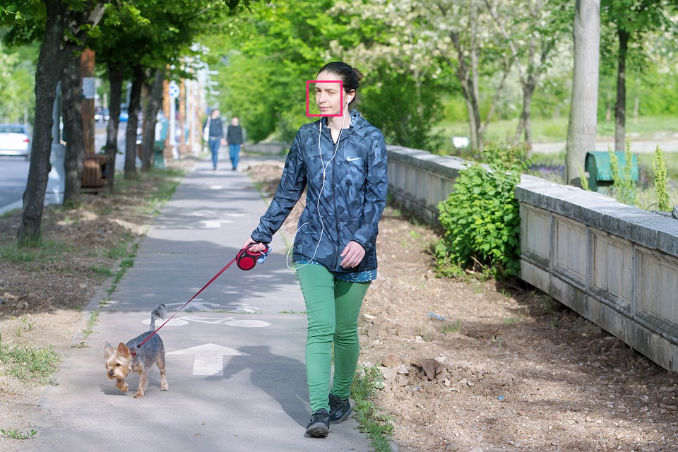

# Face Detector



## Install

```bash
pip3 install dlib
pip3 install opencv-python
```

## Usage

```python
#!/usr/bin/env python3
import cv2
import dlib

detector = dlib.get_frontal_face_detector()

frame = cv2.imread("image.jpeg")
img  = cv2.cvtColor(frame, cv2.COLOR_BGR2RGB)
upsample = 1

bounding_boxes = detector(img, upsample)

for bb in bounding_boxes:
    frame = cv2.rectangle(frame, 
        (bb.left(), bb.top()),
        (bb.right(), bb.bottom()),
        (114, 38, 249),
        2)

cv2.imshow("", frame)
cv2.waitKey(0)
```

# Source

* [Dlib Python Face Detector Example](http://dlib.net/face_detector.py.html)
